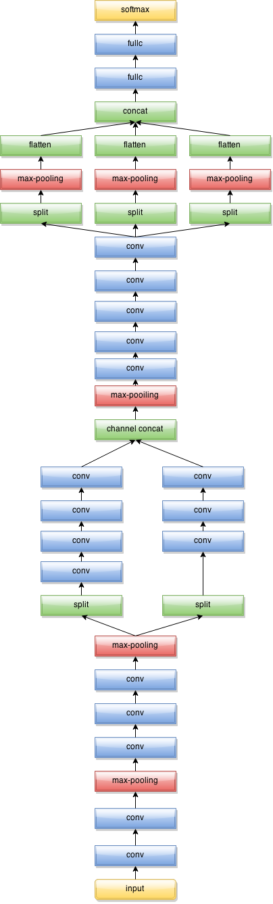
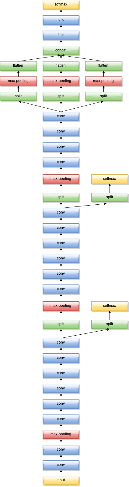

Model Documents
===


####Data Preprocessing
The models take the raw image pixels as the input. No human handcrafted feature is used. The images are resized to an identical size, such as 80x80 or 96x96 pixels.
####Data Augmentation
The following affine transformations are used:
* Mirror: randomly mirror a portion of images;
* Rotate: rotate the image with a random angle;
* Shear: shear the image randomly;
* Stretch: stretch the length or width randomly;
* zoom-in/zoom-out: zoom-in or zoom-out the image randomly;
* Crop: crop a smaller square section from the image, such as a 70*70 area from the 80*80 image.

####Network Architecture
There're 6 models contribute to the final submission. All models are developed from convolutional neural networks. The network structures are inspired by VGG networks[3], GoogLeNet[4] and Spatial Pyramid Pooling method[2]. The initialization methods are inspired by MSRA[1] and Xavier[6]. Especially, model 1-5 are inspired from [2] and [4], and model 6 is inspired by [1] and [2].

The activations used by the models include RELU activation, Insanity activation or Batch Norm[7].
Model 1-5 are similar. There're only minor differences in input sizes, augmentation steps, pooling shapes (stride=3 or stride=2), existence of Batch Norm layers, activation types and learning rate schedule step. Figure 1 shows the general network structure for model 1-5, with each block of "conv" represents a set of layers, such as {conv - batch norm - RELU} or {conv - insanity}. And the network structure of model 6 is shown in Figure 2:

Figure 1:




Figure 2:




####Training
Different training batch sizes are used to avoid the situation that log-likelihood=NAN or error rate sticks around 0.93. Most models are trained with learning rate 0.01, 0.001, and 0.0001. If the model shows significant overfitting, then skip the training step of the smaller learning rates following.

####Testing and ensembling
After training, the test data is inferred using the trained model, and then the predictions are generated. There're two ways to generate a ensembled prediction for each model:
1. Ensemble with random augmentations: predict for 150 times with random augmentation settings, then average the probability of each class. This ensemble method is applied to all models except model 3.
2. Ensemble with multiple views: Instead of random augmentation, each image is predicted using a series of fixed views from input. All predictions are averaged. This method is applied to model 3.
At last, The final result is produced by averaging the output of all the 6 models.  


####Code Description

The code provides the configuration files for the 6 models. Each model has their files in an individual folder. In each folder, the files are listed as following:

* *.conf: CXXNET model configuration files;
* Makefile: the script to run the model;
* pred.template: the template for generating predictions;
* run.py: the script to generate predictions.

####How To Generate the Solution
##### Hardware Requirements

Models are trained on 2 Geforce GTX 980 Graphics Card.  The model can be runned on a single GeForce GTX 980, but sometimes the configuration that works well with two cards doesn't work on a single card, since two cards are different random number generators. If abnormalities (such as logloss=NAN or error rate > 0.93) are observed in the first few training steps, change the batch size and seed and try again.

#####Software Dependencies

* CXXNET
* pypy (or python)

#####Steps

1. Follow the start guide of CXXNET to generate list file and binary file for input data. Notice that both size 80*80 and 96*96 are needed to be generated to reproduce my solution.
Change the train image size: change the line 12 in [gen_train.py](https://github.com/dmlc/cxxnet/blob/master/example/kaggle_bowl/gen_train.py#L12) to  ```cmd = "convert -resize 80x80\! "``` or ```cmd = "convert -resize 96x96\! "```. Also change the testimage size: change the line 12 in [gen_test.py](https://github.com/dmlc/cxxnet/blob/master/example/kaggle_bowl/gen_test.py#L12) to  ```cmd = "convert -resize 80x80\! "``` or ```cmd = "convert -resize 96x96\! "```.


2. Get a Makefile file in the folder of models. Change the paths in Makefile, run.py and all configuration file to the correct paths on your machine, and then make.
For models without a Makefile, correct all file paths in run.py and all configuration file first, then run the binary execuable file cxxnet to train the models. If there are two conf files, run the first one, then run the one ended with "_2" in its name. To generate predictions, execute run.py, and then run ```../etc/merge.py sub sub.csv```.

3. run ```pypy average.py model1/sub.csv model2/sub.csv model3/sub.csv model4/sub.csv model5/sub.csv model6/sub.csv final.csv``` to generate the ensembled final submission file.

Discussions
===
Insanity activation and insanity pooling are my great findings when wandering in CXXNET codes. Insanity activations help a faster model convergence, but insanity pooling makes the model underfit. These are my observations.
GoogLeNet performs bad in validation, so I changed the inception module to 3x3 convolutions, but one branch is initialized with gaussian random numbers, the other one is initialized with uniform random numbers (Xavier method).

Sometimes, NAN log-likelihood can be observed in the training process. My solution is removing the previous 10 models before NAN appears, and then continue training. I guess it may be something wrong with the momentum. I have suggested the authors of CXXNET to implement the Gradient Norm method[8] to prevent this situation.


There’s some ways to improve the model further: change the all pooling stride size to 2 in Model 1-4. The result would be better. But I did not have time to train them.

The performance of model 6 is very bad. I trained it in the last days when the competition was going to end. Because the training error is much lower than all other models, I used it in model ensemble for the final submission. After the competition, I submitted a result generated by model 6 only, the log-likelihood is 0.82, which is much higher than model 1-5 (0.62-0.64). But average with model 6 did help improve the final performance.


References
===
[1] He, Kaiming, et al. "Delving deep into rectifiers: Surpassing human-level performance on imagenet classification." arXiv preprint arXiv:1502.01852 (2015).

[2] He, Kaiming, et al. "Spatial pyramid pooling in deep convolutional networks for visual recognition." arXiv preprint arXiv:1406.4729 (2014).

[3] Simonyan, Karen, and Andrew Zisserman. "Very deep convolutional networks for large-scale image recognition." arXiv preprint arXiv:1409.1556 (2014).

[4] Szegedy, Christian, et al. "Going deeper with convolutions." arXiv preprint arXiv:1409.4842 (2014).

[5] Lee, Chen-Yu, et al. "Deeply-supervised nets." arXiv preprint arXiv:1409.5185 (2014).

[6] Glorot, Xavier, and Yoshua Bengio. "Understanding the difficulty of training deep feedforward neural networks." International conference on artificial intelligence and statistics. 2010.

[7] Ioffe, Sergey, and Christian Szegedy. "Batch Normalization: Accelerating Deep Network Training by Reducing Internal Covariate Shift." arXiv preprint arXiv:1502.03167 (2015).

[8] Pascanu, Razvan, Tomas Mikolov, and Yoshua Bengio. "On the difficulty of training recurrent neural networks." arXiv preprint arXiv:1211.5063 (2012).
